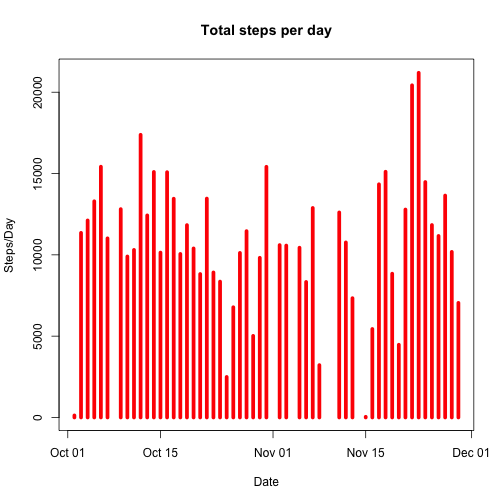

# Reproducible Research: Peer Assessment 1


## Loading and preprocessing the data

1. Load the CSV file using Date class.

  
  ```r
  activity = read.csv("activity.csv", colClasses = c("numeric", "Date", "numeric"))
  ```


## What is mean total number of steps taken per day?

1. Aggregate the steps taken by date and plot historical graph.
  
  ```r
  steps = aggregate(steps ~ date, data = activity, FUN = sum)
  plot(steps, type = "h", col = "red", lwd = 5, main = "Total steps per day", 
      ylab = "Steps/Day", xlab = "Date")
  ```
  
   


2. Calculate the mean and median total number of steps taken per day.
  
  ```r
  mean = mean(steps$steps)
  median = median(steps$steps)
  ```


  The mean and median total number of steps taken per day is **10766** and **10765** respectively.

## What is the average daily activity pattern?


## Imputing missing values


## Are there differences in activity patterns between weekdays and weekends?
