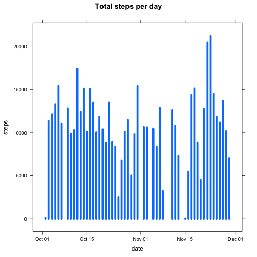
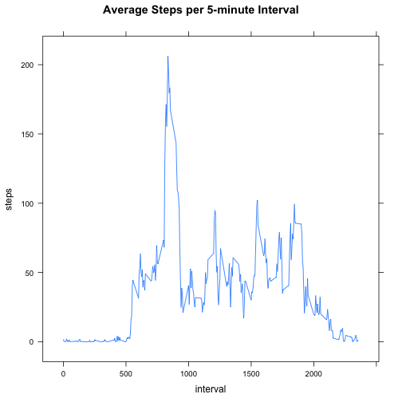
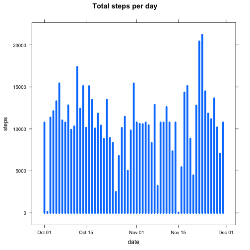
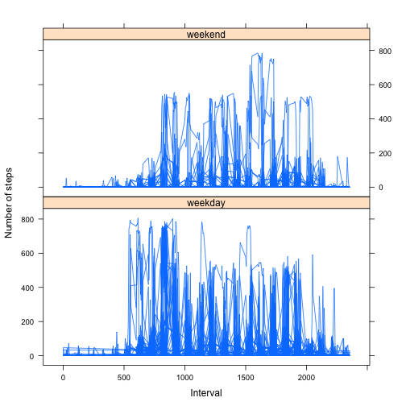

# Reproducible Research: Peer Assessment 1


## Loading and preprocessing the data

1. Load the CSV file using Date class.

  
  ```r
  activity = read.csv("activity.csv", colClasses = c("numeric", "Date", "numeric"))
  ```


## What is mean total number of steps taken per day?

1. Make a histogram of the total number of steps taken each day. 
Aggregate the steps taken by date and plot histogram.
  
  ```r
  library(lattice)
  totalsteps = aggregate(steps ~ date, data = activity, FUN = sum)
  xyplot(steps ~ date, data = totalsteps, type = "h", lwd = 5, main = "Total steps per day")
  ```
  
   


2. Calculate and report the mean and median total number of steps taken per day.
  
  ```r
  meansteps = mean(totalsteps$steps)
  mediansteps = median(totalsteps$steps)
  ```


  The mean and median total number of steps taken per day is **10766** and **10765** respectively.

## What is the average daily activity pattern?

1. Make a time series plot (i.e. type = "l") of the 5-minute interval (x-axis) and the average number of steps taken, averaged across all days (y-axis).
  
  ```r
  library(lattice)
  library(stats)
  meansteps = aggregate(steps ~ interval, data = activity, FUN = mean)
  xyplot(steps ~ interval, data = meansteps, type = "l", main = "Average Steps per 5-minute Interval")
  ```
  
   


2. Which 5-minute interval, on average across all the days in the dataset, contains the maximum number of steps?

  
  ```r
  sortedmean = meansteps[order(meansteps$steps), ]
  maxinterval = sortedmean[length(sortedmean[[2]]), 1]
  maxsteps = sortedmean[length(sortedmean[[2]]), 2]
  ```

  
  The **835**th 5-minute interval contains the maximum number, **206**, of steps.

## Imputing missing values

1. Calculate and report the total number of missing values in the dataset (i.e. the total number of rows with NAs).

  
  ```r
  nacount = sum(!complete.cases(activity))
  ```

  There are **2304** number of missing values in the dataset.
  
2. Devise a strategy for filling in all of the missing values in the dataset. The strategy is to use the mean for that 5-minute interval.

3. Create a new dataset that is equal to the original dataset but with the missing data filled in.
  Replace all NAs with mean for that 5-minute interval.
  
  
  ```r
  activity$steps = replace(activity$steps, is.na(activity$steps), meansteps$steps)
  ```

4. Make a histogram of the total number of steps taken each day and Calculate and report the mean and median total number of steps taken per day. Do these values differ from the estimates from the first part of the assignment? What is the impact of imputing missing data on the estimates of the total daily number of steps?

  Make a histogram of the total number of steps taken each day. 
  Aggregate the steps taken by date and plot histogram.
  
  ```r
  library(lattice)
  totalsteps = aggregate(steps ~ date, data = activity, FUN = sum)
  xyplot(steps ~ date, data = totalsteps, type = "h", lwd = 5, main = "Total steps per day")
  ```
  
   


  Calculate and report the mean and median total number of steps taken per day.
  
  ```r
  meansteps = mean(totalsteps$steps)
  mediansteps = median(totalsteps$steps)
  ```


  The mean and median total number of steps taken per day is **10766** and **10766** respectively. So imputing missing data did not impact the mean but did impact the median by bringing it closer to the mean.


## Are there differences in activity patterns between weekdays and weekends?

1. Create a new factor variable in the dataset with two levels, weekday and weekend indicating whether a given date is a weekday or weekend day.

  
  ```r
  activity$weekday = rep("weekend", nrow(activity))
  activity$weekday = replace(activity$weekday, weekdays(activity$date, T) %in% 
      c("Mon", "Tue", "Wed", "Thu", "Fri"), "weekday")
  activity = transform(activity, weekday = factor(weekday))
  summary(activity)
  ```
  
  ```
  ##      steps            date               interval       weekday     
  ##  Min.   :  0.0   Min.   :2012-10-01   Min.   :   0   weekday:12960  
  ##  1st Qu.:  0.0   1st Qu.:2012-10-16   1st Qu.: 589   weekend: 4608  
  ##  Median :  0.0   Median :2012-10-31   Median :1178                  
  ##  Mean   : 37.4   Mean   :2012-10-31   Mean   :1178                  
  ##  3rd Qu.: 27.0   3rd Qu.:2012-11-15   3rd Qu.:1766                  
  ##  Max.   :806.0   Max.   :2012-11-30   Max.   :2355
  ```

2. Make a panel plot containing a time series plot (i.e. type = "l") of the 5-minute interval (x-axis) and the average number of steps taken, averaged across all weekday days or weekend days (y-axis). 

  
  ```r
  library(lattice)
  xyplot(steps ~ interval | weekday, data = activity, type = "l", layout = c(1, 
      2), xlab = "Interval", ylab = "Number of steps")
  ```
  
   

